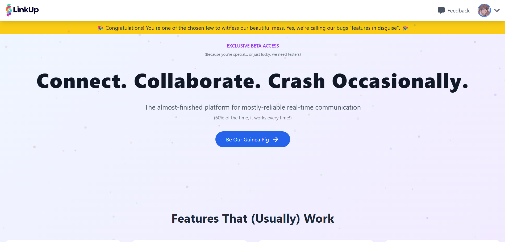
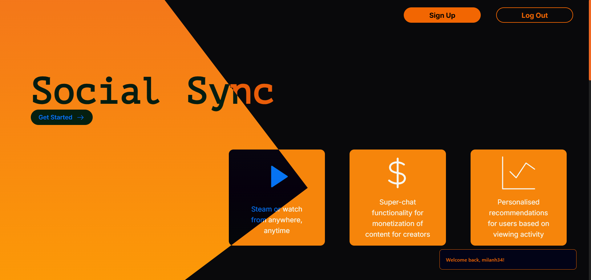

  

---

## ✨ About Me

- 🎓 Pre-final year engineering student
- 🧠 **DSA** enthusiast, love coding in **Java**  
- 🌐 Passionate about **Web Development** & **Real-time Apps** 
- 🖥️ Exploring **ElectronJS** to build powerful desktop software
- 🤝 Love collaborating and contributing to meaningful projects

---

## 🛠️ Tech Stack

  
  
  
  
  
  
  
  
  
  
  
  
  
  
  
  
  
  
  
  

---

## 🏆 GitHub Achievements

  

---

## 🚀 Featured Projects

<table>
  <tr>
    <td align="center" width="400px">
      
       
      <strong style="font-size: 20px;">🔗 LinkUp</strong> 
      <em>A real-time chat app built with MERN & WebSockets for seamless communication.</em>
        
      <a href="https://link-up-green.vercel.app/" target="_blank"><strong>🌐 Visit Site</strong></a>
    </td>
    <td></td>
    <td align="center" width="400px">
      
       
      <strong style="font-size: 20px;">🎥 SocialSync</strong> 
      <em>Stream videos live and sync playback with friends in real-time.</em>
        
      <a href="https://social-sync-one.vercel.app/" target="_blank"><strong>🌐 Visit Site</strong></a>
    </td>
  </tr>
</table>

---

## 📊 GitHub Statistics

  
  

  

---

## 🔥 Contribution Streak & Activity

  

  

---

## 🐍 Contribution Snake

---

## 🔗 Let's Connect!

  
  
  
  

---

  

---

